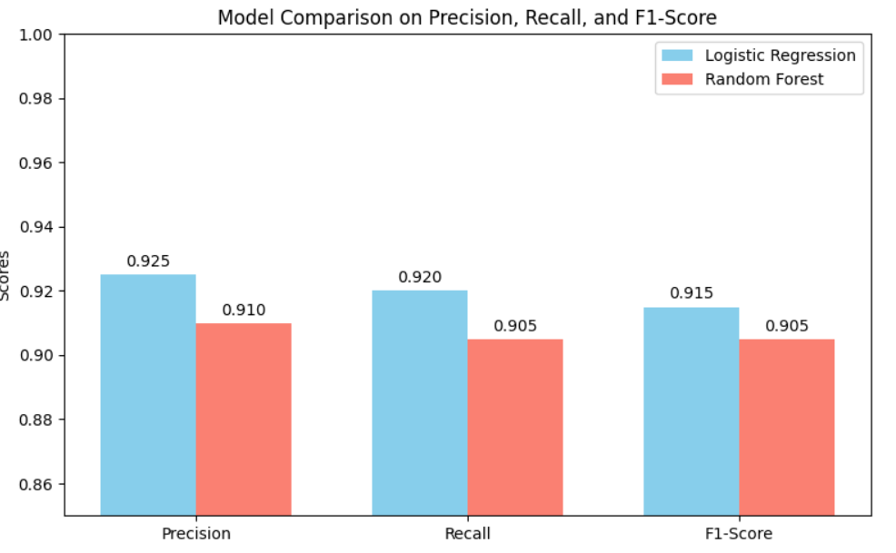
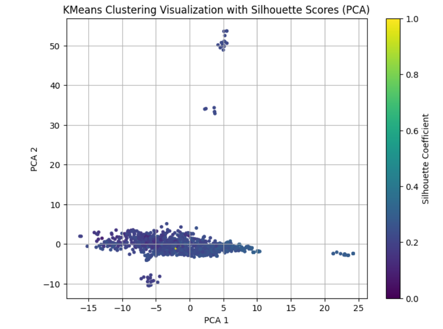

# **DETECTING REAL/FAKE JOBS WITH ML**

## **SUMMARY**
In this project, various machine learning algorithms were used to detect fake and real job postings. This dataset was evaluated using DBSCAN, Random Forest, K-Means, and Logistic Regression. Gaining insight into the patterns that distinguish real job postings from fake ones will provide a basis for additional research and possible use in job posting verification.

## **METRICS**
### **-Analysis of Exploratory Data (EDA)**

The dataset was analysed for feature properties, class distributions, and missing values during the EDA phase.  Further preprocessing procedures were guided by the understanding of underlying patterns and possible data problems provided by visualisations and statistical summaries.

### **-Data Preprocessing**

Since the dataset contains many categorical and textual values, one of the most important steps was to convert them to numeric values ​​so that they can work with machine learning algorithms. Label encoding was used for the conversion of categorical values, and TfidfVectorizer was used for the conversion of text values. NaN values ​​were filled and the dataset was prepared for Machine Learning.

### **-Supervised Learning**

For binary classification (Real/Fake job postings), Logistic Regression and Random Forest were initially compared.

Logistic Regression was chosen for its suitability for binary classification and interpretability.
Random Forest was considered for its high accuracy with categorical data and automatic feature importance.
Comparison based on Precision, Recall, and F1-Score showed Logistic Regression performed better. We proceeded with Logistic Regression as higher scores indicate better predictive capability.

Subsequently, hyperparameter tuning using Randomized Search was performed. Randomized Search was chosen over Grid Search for its time efficiency and broader exploration of the parameter space, ultimately leading to even higher scores and improved model performance.

### **-Unsupervised Learning**

For clustering, K-Means and DBSCAN were employed.

K-Means was chosen for its simplicity and speed.
DBSCAN was preferred for its density-based approach, ability to detect density differences in Real/Fake jobs, and robust noise detection capabilities.
Silhouette Scores were used for comparison: K-Means yielded 0.5894, while DBSCAN achieved 0.9746. Given this significant difference, DBSCAN was selected. Visualizations also supported this choice.

Hyperparameter tuning for DBSCAN involved using the k-distance graph to determine the optimal eps value. This optimization resulted in the Silhouette Score increasing to 0.9998, confirming superior clustering performance.

## **RESULTS**
### **-Successful Classification**

Using the Logistic Regression model, our project successfully identified whether job ads were authentic or fraudulent. Hyperparameter optimisation (using Randomised Search) led to a considerable boost in performance metrics, such as accuracy and F1-score.

### **-Effective Clustering**

The dataset's hidden density-based structures and noise points were successfully exposed using the DBSCAN method. The clusters are highly separated and have high internal consistency, according to the Silhouette Score  that was produced by modifying the eps value using the k-distance plot. This demonstrated that the density patterns of genuine and fraudulent jobs differ.

## **FUTURE WORKS**
**-Enhanced Feature Engineering:** Creating new, insightful features.

**-Advanced Text Preprocessing:** Converting words into meaningful root forms through lemmatization and thus increasing the generalization ability of the model.

**-UI/Application Development**

**-Using Advanced Clustering Techniques and Classification Algorithms**

**-Feedback Mechanism:** Establishing a learning loop that will use user feedback to continuously improve the model (when an job is verified to be fraudulent).

## **LINKS**
https://www.kaggle.com/code/ecesuvural/real-fake-jobs-posting

